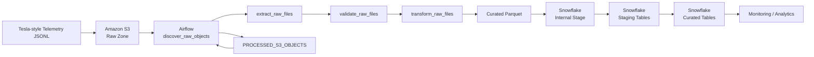

# Tesla Vehicle Telemetry ETL Pipeline

An end-to-end data engineering pipeline for ingesting Tesla-style vehicle telemetry from Amazon S3, orchestrating processing with Apache Airflow, performing data-quality validation and transformations with Python, and loading curated monitoring datasets into Snowflake.

The project is designed as a portfolio-grade ETL system demonstrating cloud storage ingestion, incremental processing, data quality, orchestration, transformation, warehouse loading, idempotent MERGE operations, testing, Docker-based local development, and CI.

---

## 1. Project Overview

Connected vehicles generate continuous telemetry such as:

- Vehicle identification
- GPS coordinates
- Speed
- Battery percentage
- Odometer readings
- Power consumption/production
- Charging state
- Tire pressure
- Outside temperature
- Event timestamps

The objective of this project is to build a reliable pipeline that:

1. Receives raw telemetry JSONL files.
2. Stores raw files in Amazon S3.
3. Detects only previously unprocessed S3 objects.
4. Downloads the raw files through Airflow.
5. Performs schema and data-quality validation.
6. Enriches and transforms the telemetry.
7. Generates hourly vehicle metrics.
8. Writes curated data as Parquet.
9. Loads the Parquet data into Snowflake.
10. Uses MERGE operations to maintain idempotent curated tables.
11. Records successfully processed S3 objects.
12. Allows subsequent pipeline runs to process only new files.

---

# 2. Architecture



### High-level data flow

```text
JSONL
  │
  ▼
Amazon S3
  │
  ▼
Airflow
  │
  ├── Discover new objects
  ├── Extract
  ├── Validate
  ├── Transform
  ├── Load
  └── Record processed objects
  │
  ▼
Parquet
  │
  ▼
Snowflake Internal Stage
  │
  ▼
Snowflake Staging Tables
  │
  ▼
MERGE
  │
  ▼
Curated Tables
```

---

# 3. Technology Stack

| Technology | Purpose |
|---|---|
| Python | ETL processing and business logic |
| Apache Airflow | Workflow orchestration |
| Docker Compose | Local Airflow environment |
| Amazon S3 | Raw telemetry object storage |
| Snowflake | Analytical warehouse |
| Pandas | Data transformation |
| PyArrow / Parquet | Curated intermediate format |
| Pytest | Automated testing |
| GitHub Actions | CI |
| PowerShell | Windows development and operational commands |

---

# 4. Key Features

## Incremental Processing

The pipeline does not process every object in S3 on every execution.

The Airflow DAG first retrieves the list of S3 objects and compares them against the Snowflake control table:

```text
PROCESSED_S3_OBJECTS
```

Only JSONL objects that have not previously been processed are selected.

Conceptually:

```text
S3 Objects
    │
    ▼
List objects
    │
    ▼
Compare against PROCESSED_S3_OBJECTS
    │
    ├── Already processed → Skip
    │
    └── New object → Process
```

This reduces unnecessary processing and provides a simple incremental ingestion strategy.

---

# 5. Idempotent Snowflake Loading

The pipeline uses Snowflake `MERGE` operations instead of blindly inserting every record.

For telemetry:

```text
EVENT_ID
```

is used as the merge key.

For hourly vehicle metrics:

```text
VIN + EVENT_DATE + EVENT_HOUR
```

is used as the merge key.

This allows the pipeline to safely reprocess data without creating duplicate logical records.

---

# 6. Airflow DAG

The main DAG is:

```text
tesla_vehicle_telemetry_etl
```

The task dependency flow is:

```text
discover_raw_objects
        │
        ▼
extract_raw_files
        │
        ▼
validate_raw_files
        │
        ▼
transform_raw_files
        │
        ▼
load_curated_to_snowflake
        │
        ▼
record_processed_objects
```

### DAG configuration

The DAG uses:

- Hourly scheduling
- `catchup=False`
- `max_active_runs=1`
- Two retries
- Five-minute retry delay
- Environment-based configuration

The relevant orchestration code is located at:

```text
dags/tesla_telemetry_etl_dag.py
```

---

# 7. Airflow Tasks

## 7.1 Discover Raw Objects

```text
discover_raw_objects
```

Responsibilities:

- List S3 objects.
- Retrieve previously processed S3 keys.
- Select only JSONL files.
- Exclude objects already present in `PROCESSED_S3_OBJECTS`.

---

## 7.2 Extract Raw Files

```text
extract_raw_files
```

Downloads selected S3 objects into the Airflow landing directory.

```text
/opt/airflow/build/landing
```

---

## 7.3 Validate Raw Files

```text
validate_raw_files
```

Each downloaded JSONL file is read and validated before transformation.

Quality checks cover areas such as:

- Required fields
- VIN validity
- Event timestamp validity
- Duplicate event IDs
- Battery percentage
- Speed
- Latitude/longitude
- Odometer
- Telemetry schema

A failed quality gate prevents invalid data from progressing through the pipeline.

---

## 7.4 Transform Raw Files

```text
transform_raw_files
```

The transformation layer:

- Reads JSONL telemetry.
- Enriches telemetry records.
- Calculates derived fields.
- Builds hourly vehicle metrics.
- Writes Parquet outputs.

The primary outputs are:

```text
telemetry_enriched.parquet
vehicle_hourly_metrics.parquet
```

---

## 7.5 Load Curated Data

```text
load_curated_to_snowflake
```

The loader:

1. Uploads Parquet files to the Snowflake internal stage.
2. Clears the temporary staging tables.
3. Executes `COPY INTO`.
4. Uses column-name matching.
5. Merges staging data into curated tables.

---

## 7.6 Record Processed Objects

```text
record_processed_objects
```

After the Snowflake load succeeds, processed S3 keys are recorded in:

```text
PROCESSED_S3_OBJECTS
```

This creates the control mechanism used by the next pipeline execution.

---

# 8. Snowflake Loading Strategy

The loading process is:

```text
Local Parquet
      │
      ▼
Snowflake Internal Stage
      │
      ▼
TELEMETRY_ENRICHED_STAGE
      │
      ▼
MERGE
      │
      ▼
TELEMETRY_ENRICHED
```

and:

```text
Local Parquet
      │
      ▼
Snowflake Internal Stage
      │
      ▼
VEHICLE_HOURLY_METRICS_STAGE
      │
      ▼
MERGE
      │
      ▼
VEHICLE_HOURLY_METRICS
```

The Snowflake SQL definitions are located in:

```text
snowflake/
├── 001_create_database_schema.sql
├── 002_create_tables.sql
└── 003_curated_models.sql
```

---

# 9. Repository Structure

```text
.
├── .github/
│   └── workflows/
│       └── ci.yml
│
├── dags/
│   └── tesla_telemetry_etl_dag.py
│
├── data/
│   └── sample/
│       ├── tesla_telemetry_sample.jsonl
│       ├── tesla_telemetry_incremental.jsonl
│       └── tesla_telemetry_new.jsonl
│
├── docs/
│   ├── architecture.md
│   └── data_dictionary.md
│
├── scripts/
│   └── run_local_etl.ps1
│
├── snowflake/
│   ├── 001_create_database_schema.sql
│   ├── 002_create_tables.sql
│   └── 003_curated_models.sql
│
├── src/
│   └── telemetry_etl/
│       ├── __init__.py
│       ├── config.py
│       ├── extract.py
│       ├── load.py
│       ├── quality.py
│       ├── schemas.py
│       └── transform.py
│
├── tests/
│   ├── test_quality.py
│   └── test_transform.py
│
├── docker-compose.yml
├── Makefile
├── pyproject.toml
├── requirements.txt
├── .env.example
├── .gitignore
└── README.md
```

---

# 10. Sample Data

The repository contains sample telemetry files for local development and incremental-load testing.

### Initial dataset

```text
data/sample/tesla_telemetry_sample.jsonl
```

Contains 5 telemetry events.

### Incremental dataset

```text
data/sample/tesla_telemetry_incremental.jsonl
```

Used to test ingestion of additional telemetry.

### Additional incremental dataset

```text
data/sample/tesla_telemetry_new.jsonl
```

Used to validate subsequent incremental processing.

These files allow the complete incremental workflow to be demonstrated without requiring a live vehicle telemetry producer.

---

# 11. Local Development

## Prerequisites

Install:

- Python 3.x
- Docker Desktop
- Git
- AWS CLI
- Access to an AWS S3 bucket
- Snowflake account

---

# 12. Python Environment

Create a virtual environment:

```powershell
python -m venv .venv
```

Activate it:

```powershell
.\.venv\Scripts\Activate.ps1
```

Install the project:

```powershell
pip install -e ".[dev]"
```

---

# 13. Environment Configuration

Create a local environment file:

```powershell
Copy-Item .env.example .env
```

Update `.env` with your own credentials and infrastructure values.

Example:

```text
AWS_REGION=<your AWS region>
S3_BUCKET=<your S3 bucket>
S3_RAW_PREFIX=raw/telemetry
S3_PROCESSED_PREFIX=processed/telemetry

SNOWFLAKE_ACCOUNT=<your Snowflake account>
SNOWFLAKE_USER=<your Snowflake username>
SNOWFLAKE_PASSWORD=<your Snowflake password>
SNOWFLAKE_ROLE=<your Snowflake role>
SNOWFLAKE_WAREHOUSE=TELEMETRY_WH
SNOWFLAKE_DATABASE=TESLA_TELEMETRY
SNOWFLAKE_SCHEMA=ANALYTICS
```

> Never commit `.env` or real credentials to Git.

---

# 14. Snowflake Setup

Execute the SQL scripts in order:

```text
snowflake/001_create_database_schema.sql
snowflake/002_create_tables.sql
snowflake/003_curated_models.sql
```

The database and schema must exist before running the Snowflake load portion of the Airflow pipeline.

---

# 15. AWS S3 Setup

Upload raw JSONL telemetry into the configured raw prefix.

Example:

```powershell
aws s3 cp `
  .\data\sample\tesla_telemetry_sample.jsonl `
  s3://<your-bucket>/raw/telemetry/tesla_telemetry_sample.jsonl `
  --region <your-region>
```

Verify:

```powershell
aws s3 ls `
  s3://<your-bucket>/raw/telemetry/ `
  --region <your-region>
```

---

# 16. Running the Local ETL

For a local Python transformation:

```powershell
.\scripts\run_local_etl.ps1
```

or use the Python package directly according to the project configuration.

The local transformation generates:

```text
build/curated/
├── telemetry_enriched.parquet
└── vehicle_hourly_metrics.parquet
```

---

# 17. Running Airflow

Initialize Airflow:

```powershell
docker compose up airflow-init
```

Start the services:

```powershell
docker compose up -d
```

Check the services:

```powershell
docker compose ps
```

Airflow is exposed locally through the configured webserver port.

The local development environment uses Docker Compose so that Airflow dependencies can be reproduced consistently.

---

# 18. Triggering the DAG

The DAG can be triggered manually:

```powershell
docker compose exec airflow-scheduler airflow dags trigger tesla_vehicle_telemetry_etl
```

List DAG runs:

```powershell
docker compose exec airflow-scheduler airflow dags list-runs tesla_vehicle_telemetry_etl
```

Inspect the task states for a specific run:

```powershell
docker compose exec airflow-scheduler `
  airflow tasks states-for-dag-run `
  tesla_vehicle_telemetry_etl `
  "<RUN_ID>"
```

---

# 19. Incremental Processing Demonstration

The pipeline was tested using multiple S3 uploads.

Example sequence:

```text
Initial dataset
    │
    └── 5 records

Incremental dataset
    │
    └── +3 records

Additional dataset
    │
    └── +2 records
```

The important behavior is that previously processed S3 objects are tracked and excluded from future ingestion.

This was validated through repeated successful Airflow executions.

---

# 20. Data Quality

The quality layer is implemented in:

```text
src/telemetry_etl/quality.py
```

The pipeline validates telemetry before transformation.

The project includes checks covering:

- Schema validation
- Required fields
- VIN
- Event timestamps
- Duplicate events
- Battery percentage
- Vehicle speed
- Geographic coordinates
- Odometer readings

The quality checks are also covered by automated tests.

---

# 21. Testing

Run the test suite:

```powershell
pytest
```

The tests are located under:

```text
tests/
├── test_quality.py
└── test_transform.py
```

The repository also contains a GitHub Actions workflow:

```text
.github/workflows/ci.yml
```

which provides automated validation of the project.

---

# 22. Development and Troubleshooting Journey

This project was developed and validated iteratively rather than assuming the initial implementation was production-ready.

Several issues were encountered during development and were resolved through command-line inspection and task-level debugging.

---

## Issue 1 — Airflow CLI syntax

An initial command used:

```powershell
airflow dags list-runs -d tesla_vehicle_telemetry_etl
```

The installed Airflow version rejected the `-d` argument.

The correct command was:

```powershell
airflow dags list-runs tesla_vehicle_telemetry_etl
```

This confirmed that CLI syntax must be checked against the Airflow version being used.

---

## Issue 2 — Failed Airflow DAG runs

Several early scheduled/manual executions failed.

Instead of only looking at the overall DAG state, individual task states were inspected:

```powershell
docker compose exec airflow-scheduler `
  airflow tasks states-for-dag-run `
  tesla_vehicle_telemetry_etl `
  "<RUN_ID>"
```

This allowed failures to be isolated at the task level.

After the configuration and loading issues were addressed, successful executions showed:

```text
discover_raw_objects          success
extract_raw_files             success
validate_raw_files            success
transform_raw_files           success
load_curated_to_snowflake     success
record_processed_objects      success
```

---

## Issue 3 — Incremental processing verification

A single successful DAG run was not considered sufficient.

Additional JSONL files were uploaded to S3 and the DAG was triggered again.

This verified that:

1. New objects were discovered.
2. Previously processed objects were ignored.
3. New data was transformed.
4. Snowflake loading completed.
5. Processed objects were recorded.

---

## Issue 4 — Configuration and secret handling

The project was configured to use environment variables instead of hard-coded credentials.

The repository contains:

```text
.env.example
```

while the actual:

```text
.env
```

is excluded through `.gitignore`.

No actual AWS or Snowflake credentials are intended to be stored in Git.

---

# 23. Security

Sensitive configuration should be provided through environment variables.

The following files should never be committed:

```text
.env
```

Generated files and local artifacts are also excluded:

```text
.venv/
build/
__pycache__/
*.parquet
*.log
```

Before publishing changes, verify:

```powershell
git status --ignored
```

and inspect tracked content:

```powershell
git grep -n -i -E "AWS_ACCESS_KEY_ID|AWS_SECRET_ACCESS_KEY|AWS_SESSION_TOKEN|PRIVATE_KEY|BEGIN .*PRIVATE KEY"
```

---

# 24. Design Decisions

## Why S3?

S3 provides durable object storage for raw telemetry and separates ingestion from downstream processing.

## Why Airflow?

Airflow provides:

- Task orchestration
- Dependency management
- Retry behavior
- Scheduling
- Operational visibility
- Task-level execution history

## Why Parquet?

Parquet provides a columnar format suitable for analytical workloads and acts as a clean intermediate representation between Python transformation and Snowflake loading.

## Why Snowflake?

Snowflake provides the analytical warehouse layer for curated telemetry and monitoring datasets.

## Why MERGE?

`MERGE` provides an idempotent loading pattern and prevents duplicate logical records when data is reprocessed.

## Why a processed-object control table?

Tracking processed S3 keys provides a straightforward incremental ingestion mechanism without requiring the entire raw dataset to be scanned and transformed during every run.

---

# 25. Production Improvements

The current project is intentionally designed as a local/portfolio implementation.

Potential production enhancements include:

- AWS IAM roles instead of long-lived credentials
- AWS Secrets Manager or another secrets manager
- S3 event notifications
- Event-driven ingestion
- Airflow deployed on managed infrastructure
- Snowflake external stages
- Snowpipe/Snowpipe Streaming
- Better partitioning strategy
- Schema evolution handling
- Data lineage
- Alerting and notifications
- Centralized logging
- Metrics and monitoring
- Great Expectations or another dedicated data-quality framework
- Terraform infrastructure-as-code
- Separate development/staging/production environments
- CI/CD deployment pipeline
- Data retention policies
- PII/security classification where applicable

---

# 26. Future Architecture

A production-oriented evolution could look like:

```text
Vehicle Telemetry
       │
       ▼
   Amazon S3
       │
       ▼
 S3 Event Notification
       │
       ▼
 Message/Event Layer
       │
       ▼
 Apache Airflow
       │
       ├── Validation
       ├── Transformation
       └── Quality Gates
       │
       ▼
 Snowflake
       │
       ├── Raw
       ├── Staging
       ├── Curated
       └── Analytics
```

---

# 27. Interview Talking Points

This project demonstrates several important data engineering concepts.

### Incremental ETL

> How would you avoid processing the same S3 files repeatedly?

Use a control table containing processed S3 object keys and process only objects that are not present in the control table.

### Idempotency

> What happens if the DAG is rerun?

The Snowflake curated tables use `MERGE` operations with business keys, allowing the same logical records to be safely reprocessed.

### Data Quality

> Where do you validate data?

Validation occurs between extraction and transformation. Invalid telemetry is prevented from continuing through the pipeline.

### Orchestration

> Why Airflow?

Airflow provides dependency management, scheduling, retries, execution history, and operational visibility.

### Warehouse Loading

> Why staging tables?

Staging tables provide an intermediate layer where Parquet data can be loaded and validated before being merged into curated tables.

### Debugging

> How did you troubleshoot failed DAG executions?

The overall DAG status was first inspected, followed by task-level state inspection using `states-for-dag-run`. This identified exactly which task failed rather than treating the DAG as a black box.

---

# 28. Validation Summary

The pipeline was validated through:

- Local transformation execution
- Automated Python tests
- Dockerized Airflow execution
- S3 ingestion
- Snowflake loading
- Multiple manual Airflow runs
- Scheduled Airflow execution
- Incremental file ingestion
- Processed-object tracking
- Snowflake MERGE operations
- Task-level Airflow state inspection

Successful executions completed the full task sequence:

```text
Discover
   ↓
Extract
   ↓
Validate
   ↓
Transform
   ↓
Load
   ↓
Record Processed Objects
```

---

# 29. Project Status

Current implementation:

```text
S3 ingestion                  ✅
Incremental processing        ✅
Data quality validation       ✅
Python transformations        ✅
Parquet generation            ✅
Snowflake loading             ✅
Snowflake MERGE               ✅
Processed object tracking     ✅
Airflow orchestration         ✅
Docker environment            ✅
Automated tests               ✅
GitHub Actions CI             ✅
Documentation                 ✅
```

---

# 30. License

See [LICENSE](LICENSE) for license information.